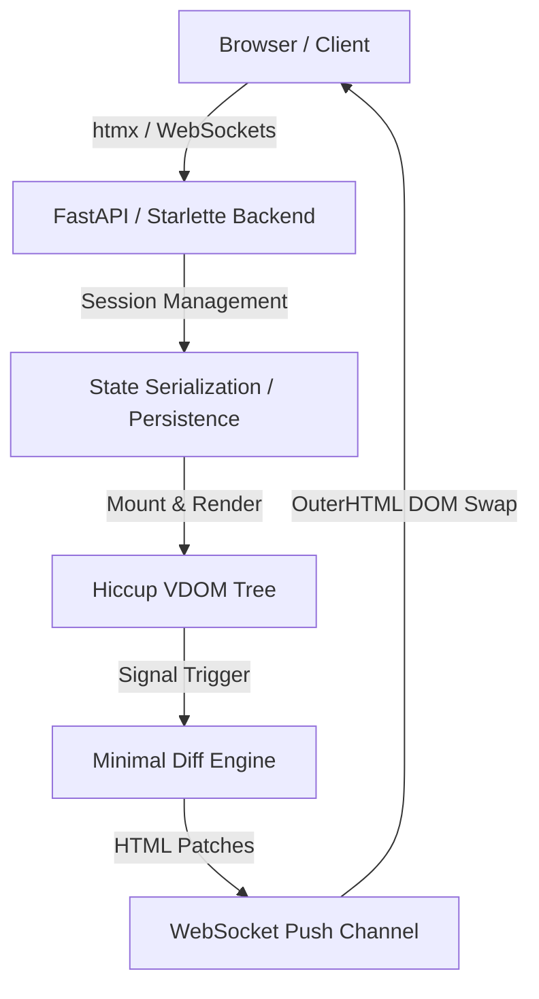

# Hiccl — Full-Stack Reactive Web Framework for Python 🧪🥒

<p align="center">
  <strong>Modern Web Framework Combining Clojure's Hiccup DSL with Pythonic Reactive State Serialization</strong>
</p>

<p align="center">
  <a href="#-philosophy">Philosophy</a> •
  <a href="#-key-features">Key Features</a> •
  <a href="#-quick-start">Quick Start</a> •
  <a href="#-architecture">Architecture</a> •
  <a href="#-offline-readiness">Offline Readiness</a>
</p>

---

## 🎨 Philosophy & Naming

**Hiccl** (pronounced `/ˈhɪk.l̩/` or "Hick-le") is the harmonic crystallization of **Hiccup** and **Pickle**:

*   **Hiccup**: Drawing pure lineage from Clojure. In Hiccl, you completely bypass writing boilerplate HTML strings. Your entire DOM structure is expressively built using elegant, nested Python data structures and lists.
*   **Pickle**: Exuding deep Pythonic roots. Represents automatic component state (State/Signal) tracking and session-based lifecycle serialization. States flow automatically through WebSockets or SSE via minimal reactive virtual-DOM diff patches.

**Hiccl** bridges the declarative simplicity of Clojure's UI design with Pythonic full-stack reactivity atop a high-performance FastAPI/Starlette server!

---

## ⚡️ Key Features

*   **⚡️ 100% Declarative Components**: Describe your UI using only nested Python lists. The framework auto-binds events (like `on_click`) into seamless server-side methods with zero boilerplate AJAX or fetch glue code.
*   **🔌 Bidirectional Reactive State**: Driven by native `Signal` and `Effect` primitives. State mutations trigger automatic virtual-DOM diffing, pushing minimal HTML patches via WebSockets/SSE to the client instantly.
*   **🎨 Built-in DaisyUI & TailwindCSS**: Ships with integrated premium dark-mode glassmorphic components (DaisyUI) and utility-first styling (TailwindCSS) to build stunning user interfaces out-of-the-box.
*   **🌿 Client-Side Acceleration with Alpine.js**: Bypasses verbose custom scripts in favor of Alpine.js, permitting high-frequency client-side interactions (like 60fps local ticking clocks and real-time clock skew calculation) defined as native attributes.
*   **📦 100% Offline & Air-Gapped Ready**: All critical static assets (`tailwind.js`, `daisyui.css`, `alpine.js`, `htmx.js`) are fully hosted locally in the `static/` folder. Build and deploy fast reactive applications in completely disconnected physical networks.
*   **🔀 Elegant Auto-Menu Component Routing**: Declare routes effortlessly using `pages=menu(Counter, TwoClocks, ChatRoom)`. Hiccl automatically generates kebab-case path endpoints and a premium glassmorphic navigation header.

---

## 🚀 Quick Start

### 1. Minimal Counter Component (`examples/counter/app.py`)

Hiccl components are clean, structural, and free of clutter:

```python
from hiccl import (
    Component,
    ComponentRegistry,
    HicclConfig,  # Config remains clean and generic
    create_hiccl_app,
    menu,
    server,
    signal,
)
from hiccl.hiccup import button, div, h2

registry = ComponentRegistry()


class Counter(Component):
    """A minimal reactive counter."""

    def __init__(self, **kwargs):
        super().__init__(**kwargs)
        self.count = signal(0)

    @server
    def increment(self, step: int = 1):
        if isinstance(step, str):
            step = int(step)
        self.count.set(self.count.get() + step)

    @server
    def decrement(self, step: int = 1):
        if isinstance(step, str):
            step = int(step)
        self.count.set(self.count.get() - step)

    @server
    def reset(self):
        self.count.set(0)

    def render(self):
        count = self.count.get()
        return div(
            {"class": "card w-96 bg-base-200 shadow-xl border border-base-300 mx-auto"},
            div(
                {"class": "card-body items-center text-center"},
                h2(
                    {"class": "card-title text-3xl font-extrabold mb-4"},
                    f"Count: {count}",
                ),
                div(
                    {"class": "card-actions justify-center gap-2"},
                    button(
                        {
                            "class": "btn btn-outline btn-error",
                            "on_click": self.decrement(5),
                        },
                        "-5",
                    ),
                    button(
                        {"class": "btn btn-error", "on_click": self.decrement(1)}, "-1"
                    ),
                    button(
                        {"class": "btn btn-neutral", "on_click": self.reset}, "Reset"
                    ),
                    button(
                        {"class": "btn btn-success", "on_click": self.increment(1)},
                        "+1",
                    ),
                    button(
                        {
                            "class": "btn btn-outline btn-success",
                            "on_click": self.increment(5),
                        },
                        "+5",
                    ),
                ),
            ),
        )


# Route and mount the component instantly!
app = create_hiccl_app(HicclConfig(component_registry=registry, pages=menu(Counter)))

if __name__ == "__main__":
    import uvicorn

    uvicorn.run(app, host="127.0.0.1", port=8000)
```

---

## 🛠 Architecture

Hiccl separates concerns cleanly to maintain high-throughput bidirectional reactive sync:



1.  **Hiccup UI Engine**: Translates nested Python arrays into HTML. Server actions annotated with `@server` are captured and serialized as network actions.
2.  **Diff Engine**: Any state mutation triggers localized dirty-checking and re-renders only the changed node, calculating the minimum HTML delta to push to the client.
3.  **Local State Transportation Layer**: Orchestrates low-latency updates via WebSockets and Server-Sent Events (SSE).

---

## 🤖 Why Hiccl is Natural-Born for the AI Era?

With AI Agents (like Antigravity) and Copilots becoming core drivers of development velocity, **the traditional decoupled frontend/backend (React/Vue + REST API + Backend) paradigm has become a heavy cognitive tax for LLMs**. Hiccl bypasses this entirely:

1. **🧩 Single-Language & Unified Mental Model**:
   - Eliminates constant context-switching between TypeScript (client) and Python (server).
   - The entire application (UI layout, reactive state, server-side events) is written 100% in declarative Python. AI only needs to reason in one programming language and one paradigm.

2. **🔌 Zero API Glue Code, Eliminating Integration Hallucinations**:
   - Bypasses writing REST/GraphQL endpoints, Pydantic schemas, Axios hooks, or client-side Redux/Pinia stores.
   - The AI simply mutates state via `self.count.set(...)` — synchronization is handled transparently. This completely eradicates integration bugs and AI schema mismatch failures.

3. **🌿 UI as Pure Python Data Structures (Hiccup)**:
   - Defining DOM using native nested lists and tag functions prevents malformed, unclosed tags typical in raw HTML/JSX generation.
   - LLMs excel at generating structured nested arrays. Combined with `mypy` / `pyright`, the entire UI is type-safe and statically verifiable in milliseconds, allowing rapid AI self-correction.

4. **⚡ Blazing Fast Testing & Self-Healing Loops**:
   - Zero Webpack/Vite build steps to wait for.
   - Hiccl components can run end-to-end assertions in pure Python memory (over **140 tests in just 0.3 seconds!**). This sub-second feedback loop enables AI agents to execute dozens of test-and-repair iterations in seconds.

---

## 📦 Offline Readiness

Hiccl is designed for secure, air-gapped internal networks. Run our combined 3-in-1 application to test the full potential of offline menu routing:

```bash
# Launch the air-gapped demo combining Counter, TwoClocks and ChatRoom
python3 examples/combined_app.py
```

### Try These Highlights:
1.  **DaisyUI Chat Bubbles**: Navigate to `/chat-room` to test a beautiful multi-user chat room synchronized in real-time across browser tabs.
2.  **DaisyUI Stats**: Navigate to `/two-clocks` to view Alpine-powered ticking clocks with live server-client time skew metrics.
3.  **Physical Disconnection**: Disconnect your internet connection completely. The application remains fully functional, navigating and rendering flawlessly with locally-hosted scripts.

---

## 📝 License

This project is licensed under the [MIT License](LICENSE).
